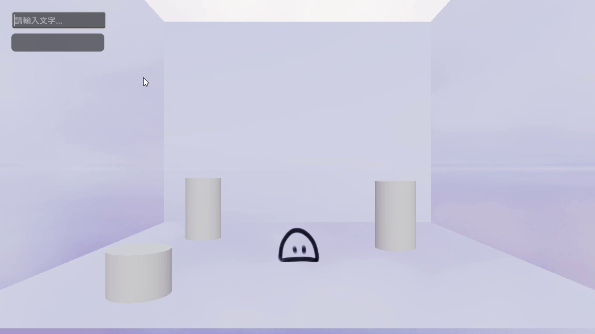
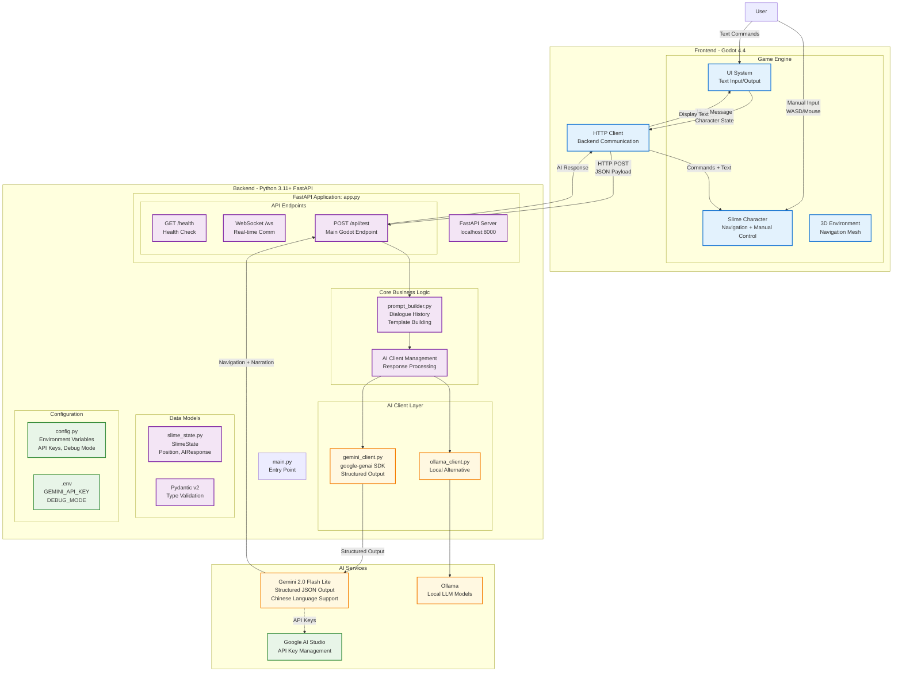

# SlimeHome



## 專案簡介

**SlimeHome** 是一個結合 LLM API 與 Godot 引擎開發的互動式可愛史萊姆小遊戲。使用者可以透過自然語言與史萊姆互動。

## 專案展示影片

[觀看 YouTube 示範影片](https://www.youtube.com/watch?v=AZt7r733Zic)

## 🔧 使用技術

* **Godot Engine 4.x**：跨平台遊戲開發引擎
* **Python FastAPI**：後端 API 架構
* **LLM API（gemini 或 ollama）**：自然語言處理

## 專案結構簡述

```
SlimeHome/
├── assets/                # 遊戲圖像與素材
│   ├── icons/
│   └── images/
├── backend/              # Python FastAPI 後端
│   └── src/
│       ├── api/
│       ├── clients/
│       ├── core/
│       ├── models/
├── image/                # 專案展示圖像與 GIF
│   └── example.gif
├── scenes/               # Godot 遊戲場景
│   ├── characters/
│   ├── environment/
│   ├── main/
│   ├── network/
│   └── ui/
└── scripts/              # GDScript 腳本
    ├── characters/
    ├── components/
    ├── controllers/
    ├── network/
    └── ui/
```

## 系統架構



### Architecture Overview

**Frontend (Godot 4.4)**
- Character system with dual control (manual + AI navigation)
- UI system for text input/output
- 3D environment with navigation mesh
- HTTP client for backend communication

**Backend (Python FastAPI)**
- API gateway with REST endpoints and WebSocket support
- AI orchestration managing multiple services (Gemini/Ollama)
- Context-aware dialogue system with conversation history
- Pydantic v2 data validation for type safety

**AI Services**
- Primary: Gemini 2.0 Flash Lite with structured JSON output
- Fallback: Ollama for local processing
- Features: Guaranteed response format, multilingual support

### Data Flow

```
User Input → UI System → HTTP Request → AI Processing → Structured Response → Character Action + UI Update
```


## 快速開始

1. 安裝 [Godot Engine](https://godotengine.org/)
2. 開啟本專案後開啟 `scenes/main/Main.tscn`
3. 在 `backend` 中設定你的 LLM API 金鑰，詳見 `backend/README.md`
4. 啟動後端 FastAPI Sever
5. 點擊執行，開始與可愛的史萊姆互動！

